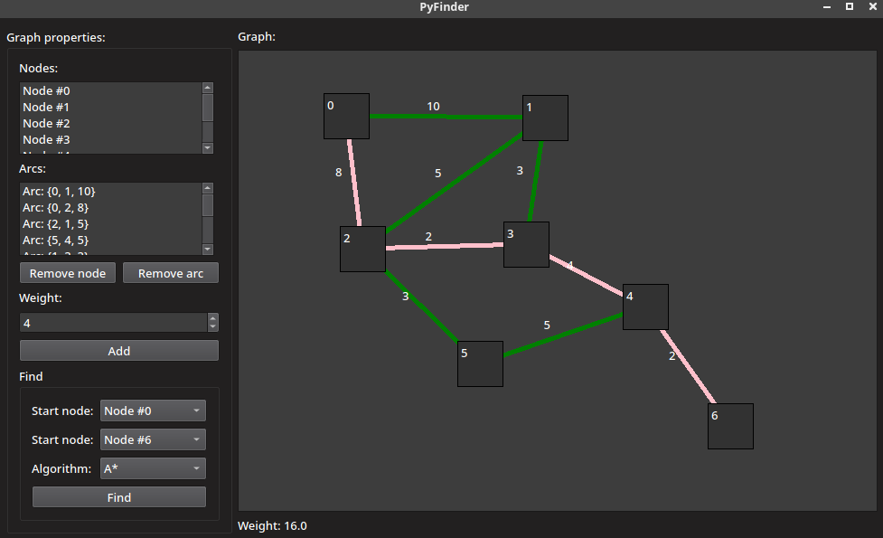

# PyFinder

## Table of Contents

- [Description](#description)
- [Screenshot](#screenshot)
- [Run](#run)
- [F.A.Q.](#faq)

## Description
The program allows you to find the shortest path on a graph using the algorithms BFS (breadth-first search), Dijkstra and A * (A star).
The project is written in Python.

## Screenshot

## Run
> $ pip3 install -r requirements.txt && python3 main.py

## F.A.Q.

### Placement of nodes

To place a node - click on the plane (*note that you cannot place nodes closely*).

### Connecting nodes

To connect nodes, double-click on the first node, and then on the second. Then set the weight of the arc on the left panel and click **Add**.

### Removing nodes / arcs

To delete a node / arc, select it in the list on the left panel and click **Delete node / arc**.

### Finding the way

To search for the path, select the start and end node in the left pane, select the search algorithm and click **Find**.
